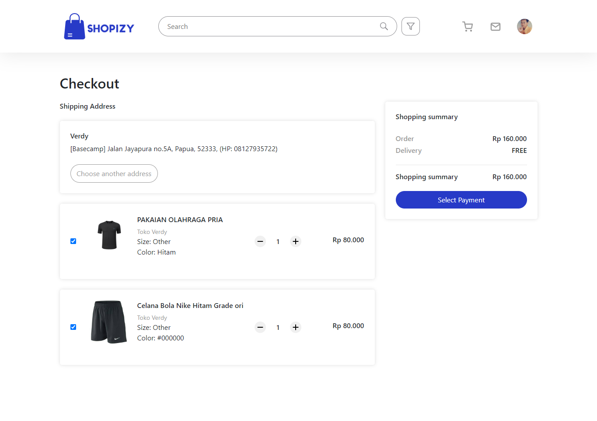

<p align="center">
<div align="center">
  
</div>
  <h3 align="center">Shopizy Frontend</h3>
  <p align="center">
    <a href="https://github.com/VerdyNordsten/shopizy"><strong>Explore the docs »</strong></a>
    <br />
    <a href="https://shopizy.digty.co.id/">View Demo</a>
    ·
    <a href="https://shopizy.up.railway.app/">Api Demo</a>
  </p>
</p>

<!-- TABLE OF CONTENTS -->

## Table of Contents

- [Table of Contents](#table-of-contents)
- [About The Project](#about-the-project)
  - [Built With](#built-with)
- [Getting Started](#getting-started)
  - [Prerequisites](#prerequisites)
  - [Requirements](#requirements)
  - [Installation](#installation)
  - [Setup .env](#setup-env)
- [Screenshots](#screenshots)
- [Related Project](#related-project)

<!-- ABOUT THE PROJECT -->

## About The Project

Shopizy is an e-commerce application designed to provide users with a seamless online shopping experience. The platform offers a diverse range of products from various sellers, allowing users to browse and purchase items conveniently from their preferred devices.

One of the standout features of Shopizy is its intuitive interface, which makes it easy for users to navigate through different categories, explore product details, and compare prices. This helps users make informed purchasing decisions and find the best deals available.

Shopizy also offers secure payment options to ensure a safe transaction process. Users can choose from a variety of payment methods and rest assured that their personal and financial information is protected.

To use Shopizy, users can create an account or shop as a guest. The application provides personalized recommendations based on users' browsing and purchasing history, making it easier to discover new products that align with their interests.

With Shopizy, online shopping becomes a hassle-free experience, enabling users to find and purchase the products they need with just a few clicks. Whether it's fashion, electronics, home goods, or any other category, Shopizy caters to the diverse needs of users, making it a go-to destination for e-commerce.

<!-- GETTING STARTED -->

## Getting Started

### Prerequisites

This is an example of how to list things you need to use the software and how to install them.

- [nodejs](https://nodejs.org/en/download/)
- [React JS](https://react.dev/)

| Third Party               | npm install                           |
| ------------------------- | ------------------------------------- |
| [@fortawesome/fontawesome-free]     | npm i @fortawesome/fontawesome-free@6.1.1 |
| [@fortawesome/fontawesome-svg-core]   | npm i @fortawesome/fontawesome-svg-core@6.1.1 |
| [@fortawesome/free-brands-svg-icons] | npm i @fortawesome/free-brands-svg-icons@6.1.1 |
| [@fortawesome/free-regular-svg-icons] | npm i @fortawesome/free-regular-svg-icons@6.1.1 |
| [@fortawesome/free-solid-svg-icons] | npm i @fortawesome/free-solid-svg-icons@6.1.1 |
| [@fortawesome/react-fontawesome]        | npm i @fortawesome/react-fontawesome@0.1.18 |
| [@testing-library/jest-dom]   | npm i @testing-library/jest-dom@5.16.4 |
| [@testing-library/react]     | npm i @testing-library/react@13.3.0 |
| [@testing-library/user-event] | npm i @testing-library/user-event@13.5.0 |
| [autoprefixer]             | npm i autoprefixer@10.4.5 |
| [axios]                   | npm i axios@0.27.2                     |
| [bootstrap]               | npm i bootstrap@5.1.3                  |
| [jwt-decode]              | npm i jwt-decode@3.1.2                 |
| [moment]                  | npm i moment@2.29.3                    |
| [react]                   | npm i react@18.1.0                     |
| [react-content-loader]    | npm i react-content-loader@6.2.0       |
| [react-dom]               | npm i react-dom@18.1.0                 |
| [react-redux]             | npm i react-redux@8.0.2                |
| [react-router-dom]        | npm i react-router-dom@6.3.0           |
| [react-scripts]           | npm i react-scripts@5.0.1              |
| [react-select]            | npm i react-select@5.3.2               |
| [react-toastify]          | npm i react-toastify@8.2.0             |
| [reactstrap]              | npm i reactstrap@9.0.4                |
| [redux]                   | npm i redux@4.2.0                       |
| [redux-devtools-extension] | npm i redux-devtools-extension@2.13.9  |
| [redux-form]           | npm i redux-form@8.3.10           |
| [redux-form-input-masks]   | npm i redux-form-input-masks@2.0.2 |
| [redux-logger]           | npm i redux-logger@3.0.6 |
| [redux-persist]          | npm i redux-persist@6.0.0 |
| [redux-promise-middleware] | npm i redux-promise-middleware@6.1.2 |
| [redux-thunk]             | npm i redux-thunk@2.4.1 |
| [socket.io-client]        | npm i socket.io-client@4.5.1            |
| [sweetalert2]             | npm i sweetalert2@11.4.17               |
| [swiper]                  | npm i swiper@8.2.2                      |
| [web-vitals]              | npm i web-vitals@2.1.4                  |

[@fortawesome/fontawesome-free]: https://www.npmjs.com/package/@fortawesome/fontawesome-free
[@fortawesome/fontawesome-svg-core]: https://www.npmjs.com/package/@fortawesome/fontawesome-svg-core
[@fortawesome/free-brands-svg-icons]: https://www.npmjs.com/package/@fortawesome/free-brands-svg-icons
[@fortawesome/free-regular-svg-icons]: https://www.npmjs.com/package/@fortawesome/free-regular-svg-icons
[@fortawesome/free-solid-svg-icons]: https://www.npmjs.com/package/@fortawesome/free-solid-svg-icons
[@fortawesome/react-fontawesome]: https://www.npmjs.com/package/@fortawesome/react-fontawesome
[@testing-library/jest-dom]: https://www.npmjs.com/package/@testing-library/jest-dom
[@testing-library/react]: https://www.npmjs.com/package/@testing-library/react
[@testing-library/user-event]: https://www.npmjs.com/package/@testing-library/user-event
[autoprefixer]: https://www.npmjs.com/package/autoprefixer
[axios]: https://www.npmjs.com/package/axios
[bootstrap]: https://www.npmjs.com/package/bootstrap
[jwt-decode]: https://www.npmjs.com/package/jwt-decode
[moment]: https://www.npmjs.com/package/moment
[react]: https://www.npmjs.com/package/react
[react-content-loader]: https://www.npmjs.com/package/react-content-loader
[react-dom]: https://www.npmjs.com/package/react-dom
[react-redux]: https://www.npmjs.com/package/react-redux
[react-router-dom]: https://www.npmjs.com/package/react-router-dom
[react-scripts]: https://www.npmjs.com/package/react-scripts
[react-select]: https://www.npmjs.com/package/react-select
[react-toastify]: https://www.npmjs.com/package/react-toastify
[reactstrap]: https://www.npmjs.com/package/reactstrap
[redux]: https://www.npmjs.com/package/redux
[redux-devtools-extension]: https://www.npmjs.com/package/redux-devtools-extension
[redux-form]: https://www.npmjs.com/package/redux-form
[redux-form-input-masks]: https://www.npmjs.com/package/redux-form-input-masks
[redux-logger]: https://www.npmjs.com/package/redux-logger
[redux-persist]: https://www.npmjs.com/package/redux-persist
[redux-promise-middleware]: https://www.npmjs.com/package/redux-promise-middleware
[redux-thunk]: https://www.npmjs.com/package/redux-thunk
[socket.io-client]: https://www.npmjs.com/package/socket.io-client
[sweetalert2]: https://www.npmjs.com/package/sweetalert2
[swiper]: https://www.npmjs.com/package/swiper
[web-vitals]: https://www.npmjs.com/package/web-vitals

### Installation

- Clone This Front End Repo

```
git clone https://github.com/VerdyNordsten/shopizy
```

- Go To Folder Repo

```
cd shopizy
```

- Install Module

```
npm install
```

- <a href="#setup-env">Setup .env</a>
- Type ` npm run dev` To Start Website
- Type ` npm run production` To Start Production

### Setup .env

Create .env file in your root project folder.

```
REACT_APP_API_URL = [BACKEND_URL]
```

<!-- ROADMAP -->

## Screenshots

<table>
<div align="center">
  <tr>
    <td></td>
  </tr>
  <tr>
    <td>Home Page</td>
  </tr>
  <tr>
    <td> </td>
  </tr>
  <tr>
    <td>Detail Product</td>
  </tr>
  <tr>
    <td> </td>
  </tr>
  <tr>
    <td>Category</td>
  </tr>
  <tr>
    <td> </td>
  </tr>
  <tr>
    <td>Cart</td>
  </tr>
  <tr>
    <td> </td>
  </tr>
  <tr>
    <td>Checkout</td>
  </tr>
  <tr>
    <td> </td>
  </tr>
  <tr>
    <td>Login</td>
  </tr>
  <tr>
    <td> </td>
  </tr>
  <tr>
    <td>Register</td>
  </tr>
  <tr>
    <td> </td>
  </tr>
  <tr>
    <td>Add Address</td>
  </tr>
  <tr>
    <td> </td>
  </tr>
  <tr>
    <td>Add Product</td>
  </tr>
  <tr>
    <td> </td>
  </tr>
  <tr>
    <td>Profile User</td>
  </tr>
</div>
</table>

## Related Project

:rocket: [`Backend Shopizy`](https://github.com/VerdyNordsten/shopizy_backend)

:rocket: [`Frontend Shopizy`](https://github.com/VerdyNordsten/shopizy)

:rocket: [`Demo Shopizy`](https://shopizy.digty.co.id/)

Project Link: [https://github.com/VerdyNordsten/shopizy](https://github.com/VerdyNordsten/shopizy)